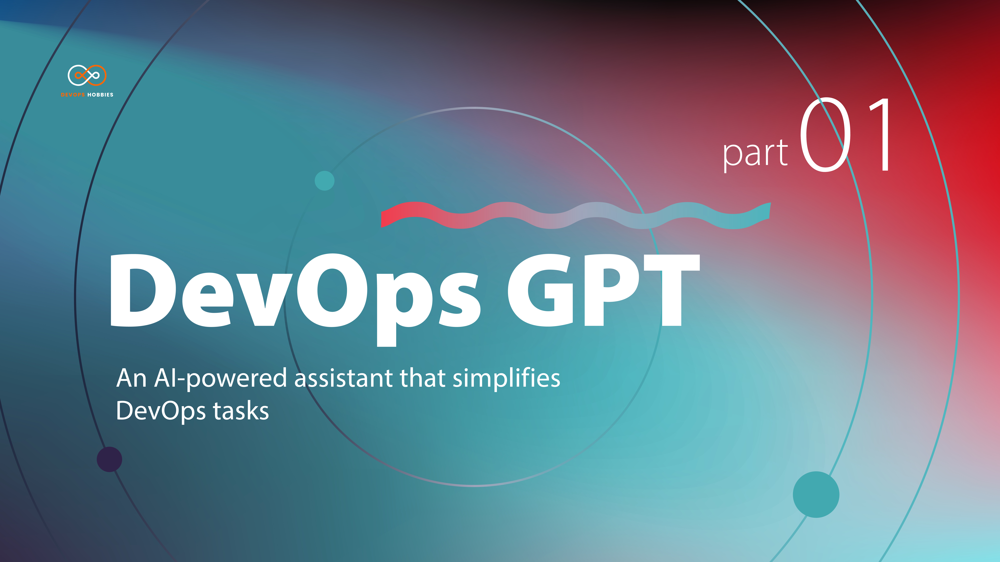

[](https://youtu.be/IPXmjUcDZJU?si=4S5U_y8Jr1u5gOrh)

# DevOps-GPT

This project helps you to balance your daily work as a DevOps engineer, from simple bug fixes to project template generation. you don't need to search on Google for some routine jobs and it helps you with a robust prompt to simplify your career.

## Run DevOpsGPT

Builds and starts the Docker Compose stack:
     
    make
    
Stops and removes the Docker Compose stack:

    make down

 Installs the Helm chart for the devopsgpt app on a Kubernetes cluster:

    make helm-install

Uninstalls the Helm chart for the devopsgpt app:

    make helm-uninstall

You can override the release name and namespace for Helm commands by running:

    make [helm-install|helm-uninstall] namespace=NAMESPACE releaseName=RELEASENAME

The default namespace is `default` and the default release name is `devopsgpt`.


## Running Tests

To run tests, run the following command

```
cd app && pytest tests/
```


## Environment Variables

To run this project, you will need to add the following environment variables to your .env file

`KEY` (OpenAI API Key)


## API Reference

#### Download the generated projects

```
GET /download-folder{folder_name}/{source}
```

| Parameter | Type     | Description                       |
| :-------- | :------- | :-------------------------------- |
| `folder_name`      | `string` | **Required** |
| `source`      | `string` | **Required** |


#### Post terraform basic questions

```
POST /IaC-basic/
```

| Request Body | Type     | Description                       |
| :-------- | :------- | :-------------------------------- |
| `max_tokens`      | `int` | **Required** |
| `min_tokens`      | `int` | **Required** |
| `service`      | `string` | **Required** |
| `input`      | `string` | **Required** |


#### Post terraform bugfix

```
POST /IaC-bugfix/
```

| Request Body | Type     | Description                       |
| :-------- | :------- | :-------------------------------- |
| `max_tokens`      | `int` | **Required** |
| `min_tokens`      | `int` | **Required** |
| `service`      | `string` | **Required** |
| `bug_description`      | `string` | **Required** |
| `version`      | `string` | **Required** |


#### Post terraform installation

```
POST /IaC-install/
```

| Request Body | Type     | Description                       |
| :-------- | :------- | :-------------------------------- |
| `os`      | `string` | **Required** |
| `service`      | `string` | **Required** |


#### Post terraform template generation of docker resources

```
POST /IaC-template/docker
```

| Request Body | Type     | Description                       |
| :-------- | :------- | :-------------------------------- |
| `docker_image`      | `boolean` | **Required** |
| `docker_container`      | `boolean` | **Required** |


#### Post terraform template generation of Ec2 resources

```
POST /IaC-template/aws/ec2
```

| Request Body | Type     | Description                       |
| :-------- | :------- | :-------------------------------- |
| `key_pair`      | `boolean` | **Required** |
| `security_group`      | `boolean` | **Required** |
| `aws_instance`      | `boolean` | **Required** |
| `ami_from_instance`      | `boolean` | **Required** |

#### Post terraform template generation of S3 resources

```
POST /IaC-template/aws/s3
```

| Request Body | Type     | Description                       |
| :-------- | :------- | :-------------------------------- |
| `s3_bucket`      | `boolean` | **Required** |
| `s3_bucket_versioning`      | `boolean` | **Required** |


#### Post terraform template generation of IAM resources

```
POST /IaC-template/aws/iam
```

| Request Body | Type     | Description                       |
| :-------- | :------- | :-------------------------------- |
| `iam_user`      | `boolean` | **Required** |
| `iam_group`      | `boolean` | **Required** |


#### Post terraform template generation of ELB resources

```
POST /IaC-template/aws/elb
```

| Request Body | Type     | Description                       |
| :-------- | :------- | :-------------------------------- |
| `security_group`      | `boolean` | **Required** |
| `lb_target_group`      | `boolean` | **Required** |
| `lb`      | `boolean` | **Required** |
| `lb_listener_rule`      | `boolean` | **Required** |
| `key_pair`      | `boolean` | **Required** |
| `launch_configuration`      | `boolean` | **Required** |
| `autoscaling_group`      | `boolean` | **Required** |
| `autoscaling_attachment`      | `boolean` | **Required** |
| `autoscaling_policy`      | `boolean` | **Required** |


#### Post terraform template generation of EFS resources

```
POST /IaC-template/aws/efs
```

| Request Body | Type     | Description                       |
| :-------- | :------- | :-------------------------------- |
| `efs_file_system`      | `boolean` | **Required** |
| `efs_mount_target`      | `boolean` | **Required** |
| `efs_backup_policy`      | `boolean` | **Required** |

#### Post terraform template generation of ArgoCD resources

```
POST /IaC-template/aws/argocd
```

| Request Body | Type     | Description                       |
| :-------- | :------- | :-------------------------------- |
| `argocd_applicatio.sync_policy.auto_prune`      | `boolean` | **No-Required** |
| `argocd_applicatio.sync_policy.self_heal`      | `boolean` | **No-Required** |
| `argocd_applicatio.sync_policy.argocd_repository`      | `boolean` | **Required** |
| `argocd_applicatio.sync_policy.application_depends_repository`      | `boolean` | **Required** |

#### Post Helm template generation

```
POST /Helm-template
```

| Request Body | Type     | Description                       |
| :-------- | :------- | :-------------------------------- |
| `api_version`      | `integer` | **Required** |
| `pods.name`      | `string` | **Required** |
| `pods.image`      | `string` | **Required** |
| `pods.target_port`      | `integer` | **Required** |
| `pods.replicas`      | `integer` | **Required** |
| `pods.persistance`      | `dict` | **Required** |
| `pods.environment`      | `list(dict)` | **Required** |
| `pods.stateless`      | `boolean` | **Required** |
| `pods.ingress`      | `dict` | **Required** |

#### Post Ansible install Nginx

```
POST /ansible-install/nginx
```

| Request Body | Type     | Description                       |
| :-------- | :------- | :-------------------------------- |
| `ansible_user`      | `string` | **Required** |
| `ansible_port`      | `string` | **Required** |
| `os`      | `string` | **Required** |
| `hosts`      | `list` | **Required** |
| `version`      | `string` | **Required** |


#### Post Ansible install Docker

```
POST /ansible-install/docker
```

| Request Body | Type     | Description                       |
| :-------- | :------- | :-------------------------------- |
| `ansible_user`      | `string` | **Required** |
| `ansible_port`      | `string` | **Required** |
| `os`      | `string` | **Required** |
| `hosts`      | `list` | **Required** |

#### Post Ansible install Kubernetes

```
POST /ansible-install/kuber
```

| Request Body | Type     | Description                       |
| :-------- | :------- | :-------------------------------- |
| `ansible_user`      | `string` | **Required** |
| `ansible_port`      | `string` | **Required** |
| `os`      | `string` | **Required** |
| `hosts`      | `list` | **Required** |
| `version`      | `string` | **Required** |
| `k8s_worker_nodes`      | `list` | **Required** |
| `k8s_master_nodes`      | `list` | **Required** |

#### Post docker compose generation

```
POST /docker-compose
```

| Request Body | Type     | Description                       |
| :-------- | :------- | :-------------------------------- |
| `networks.app_network.driver`      | `string` | **Required** |
| `version`      | `string` | **Required** |
| `services`      | `list` | **Required** |

## Tech Stack

**Client:** React + TypeScript + Vite

**Server:** Python + FastAPI

**Containerization:** Docker + Kubernetes

**CI/CD**: Github Actions


## Contributing

Contributions are always welcome!

See [CONTRIBUTING.md](CONTRIBUTING.md) for ways to get started.


# Maintenance

** [Abolfazl Andalib](https://github.com/abolfazl8131) - abolfazlandalib@gmail.com **

** [Mohammad Madanipour](https://github.com/mohammadll) - m.madanipourr@gmail.com **
